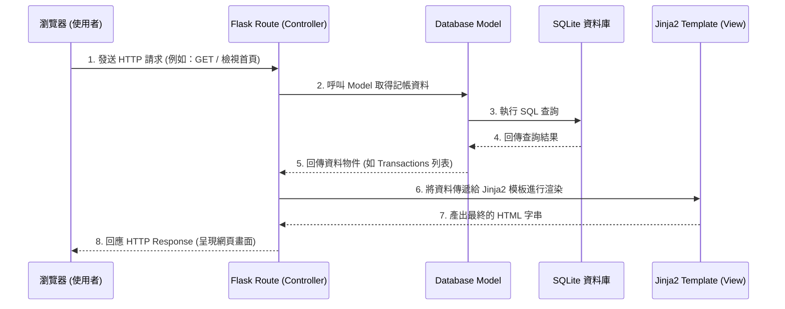

# 系統架構設計 - 個人記帳簿系統

本文件依據 [產品需求文件 (PRD)](PRD.md) 的需求，規劃個人記帳簿系統的技術架構與資料夾結構。

## 1. 技術架構說明

本系統採用傳統的 Web 應用程式架構，不進行前後端分離，透過後端框架直接渲染 HTML 頁面給瀏覽器。

### 選用技術與原因
- **後端框架：Python + Flask**
  - **原因**：Flask 輕量、靈活且學習曲線平緩，非常適合用來快速開發中小型專案（如個人記帳簿）。其豐富的擴充套件也能輕鬆應付後續需求。
- **前端模板引擎：Jinja2**
  - **原因**：與 Flask 完美整合，能讓後端動態生成的資料（如記帳紀錄、統計數據）無縫嵌入 HTML 頁面中，簡化開發流程。
- **資料庫：SQLite**
  - **原因**：設定極為簡單，不需架設獨立的資料庫伺服器，所有資料儲存在單一檔案中，非常適合個人記帳系統的資料規模及快速原型開發。

### Flask MVC 模式說明
雖然 Flask 本身不強制規定 MVC，但我們將依循 MVC（Model-View-Controller）的設計模式來組織程式碼：
- **Model（模型）**：負責與 SQLite 資料庫互動，定義資料表結構（如使用者 `User`、記帳紀錄 `Transaction`、分類 `Category`）以及資料的新刪修查邏輯。
- **View（視圖）**：負責呈現使用者介面。在這裡指的是 `templates/` 資料夾內的 Jinja2 HTML 檔案。
- **Controller（控制器）**：負責處理商業邏輯。在這裡指的是 Flask 的 `routes/` 路由函數，負責接收瀏覽器的請求（Request）、呼叫 Model 取得資料，並將資料傳遞給 View 渲染成最終頁面回應（Response）給使用者。

## 2. 專案資料夾結構

以下為本專案建議的目錄結構：

```text
web_app_development2/
├── app.py                 # 應用程式入口（主程式），負責啟動 Flask 伺服器
├── config.py              # 系統設定檔（如資料庫連線字串、Secret Key 等）
├── requirements.txt       # 紀錄專案所需的所有 Python 套件
├── app/                   # 主要的應用程式資料夾
│   ├── __init__.py        # 初始化 Flask app 實例與資料庫連線
│   ├── models/            # [Model] 資料庫模型
│   │   ├── __init__.py
│   │   ├── user.py        # 使用者模型
│   │   └── transaction.py # 記帳紀錄與分類模型
│   ├── routes/            # [Controller] 路由控制器
│   │   ├── __init__.py
│   │   ├── auth.py        # 註冊、登入相關路由
│   │   └── main.py        # 記帳、統計、首頁等主要路由
│   ├── templates/         # [View] Jinja2 HTML 模板
│   │   ├── base.html      # 共用的母版（包含導覽列、頁尾）
│   │   ├── index.html     # 首頁（總覽/圖表）
│   │   ├── login.html     # 登入/註冊頁面
│   │   └── form.html      # 新增/編輯記帳紀錄頁面
│   └── static/            # 靜態資源檔案
│       ├── css/
│       │   └── style.css  # 自訂樣式表
│       ├── js/
│       │   └── main.js    # 自訂前端腳本（如圖表初始化）
│       └── images/        # 圖片資源
├── instance/              # 存放敏感或運行時產生的檔案（不應進入 Git 版本控制）
│   └── database.db        # SQLite 資料庫檔案
└── docs/                  # 專案文件
    ├── PRD.md             # 產品需求文件
    └── ARCHITECTURE.md    # 系統架構設計文件 (本文件)
```

## 3. 元件關係圖

以下展示使用者在瀏覽器操作時，系統各元件之間的資料流向與互動關係：



## 4. 關鍵設計決策

1. **採用藍圖 (Blueprints) 模組化路由**
   - **原因**：為了避免 `app.py` 變得過於龐大與難以維護，我們將路由拆分為 `auth.py` (負責驗證) 與 `main.py` (負責核心記帳功能)，透過 Flask Blueprint 註冊回主程式。這有助於後續團隊分工開發。
2. **基於 Jinja2 模板繼承機制**
   - **原因**：透過設計一個共用的 `base.html` 母版，包含共同的 Navigation Bar（導覽列）與 CSS/JS 引用，可以確保各頁面設計風格一致，同時減少重複的 HTML 程式碼。
3. **選擇 SQLite 作為初期資料庫**
   - **原因**：無需額外的資料庫伺服器建置成本，開發與部署都極為方便。透過將 `database.db` 獨立放置於 `instance/` 資料夾，可以確保測試與生產資料庫的彈性管理。
4. **將商業邏輯集中在 Controller (Routes)**
   - **原因**：為了保持 View 的單純（僅負責顯示），所有資料過濾、統計計算與權限檢查都會在 Route 層完成，最後才把乾淨的資料丟給 Template。這讓程式碼更容易測試與追蹤。
