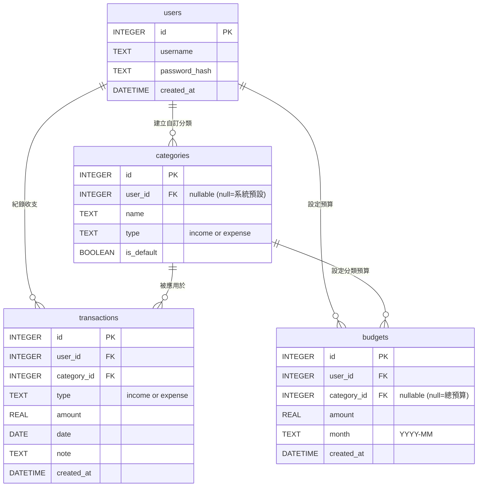

# 資料庫設計文件 - 個人記帳簿系統

本文件詳細列出個人記帳簿系統的資料庫 Schema 與各資料表說明。我們採用 SQLite 作為關聯式資料庫。

## 1. ER 圖（實體關係圖）

以下展示系統內各個資料表及其關聯：

## 2. 資料表詳細說明

### `users` (使用者表)
儲存使用者帳號與密碼資訊。
- `id`: INTEGER PRIMARY KEY AUTOINCREMENT。唯一識別碼。
- `username`: TEXT UNIQUE NOT NULL。使用者登入帳號。
- `password_hash`: TEXT NOT NULL。加密後的使用者密碼。
- `created_at`: DATETIME DEFAULT CURRENT_TIMESTAMP。建立時間。

### `categories` (收支分類表)
儲存系統預設與使用者自訂的分類。
- `id`: INTEGER PRIMARY KEY AUTOINCREMENT。
- `user_id`: INTEGER (Foreign Key referencing `users.id`)。若為 NULL 代表此分類為系統預設（所有人皆可見）。
- `name`: TEXT NOT NULL。分類名稱（如：餐飲、交通）。
- `type`: TEXT NOT NULL。區分此分類屬於 `income`（收入）或 `expense`（支出）。
- `is_default`: BOOLEAN DEFAULT 0。是否為預設分類。

### `transactions` (記帳紀錄表)
儲存使用者的每一筆收入或支出紀錄。
- `id`: INTEGER PRIMARY KEY AUTOINCREMENT。
- `user_id`: INTEGER NOT NULL (Foreign Key referencing `users.id`)。誰記錄的。
- `category_id`: INTEGER NOT NULL (Foreign Key referencing `categories.id`)。屬於哪個分類。
- `type`: TEXT NOT NULL。屬於 `income` 或 `expense`。
- `amount`: REAL NOT NULL。金額。
- `date`: DATE NOT NULL。發生日期（YYYY-MM-DD）。
- `note`: TEXT。備註（非必填）。
- `created_at`: DATETIME DEFAULT CURRENT_TIMESTAMP。建立時間。

### `budgets` (預算設定表)
儲存使用者每個月的預算設定。
- `id`: INTEGER PRIMARY KEY AUTOINCREMENT。
- `user_id`: INTEGER NOT NULL (Foreign Key referencing `users.id`)。誰設定的。
- `category_id`: INTEGER (Foreign Key referencing `categories.id`)。若為 NULL 代表此預算為該月份的「總預算」，若有值則為「該分類專屬預算」。
- `amount`: REAL NOT NULL。預算金額。
- `month`: TEXT NOT NULL。設定預算的月份，格式為 `YYYY-MM`。
- `created_at`: DATETIME DEFAULT CURRENT_TIMESTAMP。建立時間。
