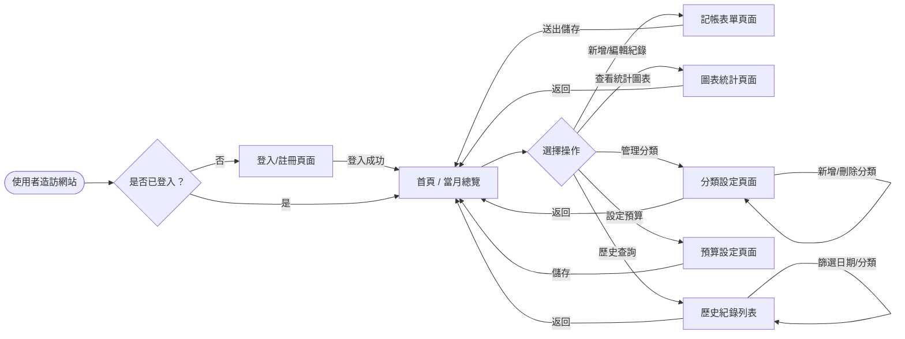
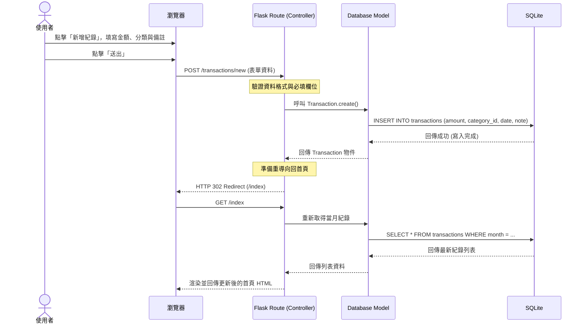

# 流程圖與路由設計 - 個人記帳簿系統

本文件根據 [PRD](PRD.md) 與 [系統架構](ARCHITECTURE.md) 繪製使用者操作路徑與系統資料流，並初步規劃 URL 路由對照表。

## 1. 使用者流程圖（User Flow）

此流程圖描述使用者從進入系統開始，如何與各項功能進行互動。

## 2. 系統序列圖（Sequence Diagram）

以下序列圖描述「新增一筆記帳紀錄」時，前端（瀏覽器）與後端（Flask、SQLite）的資料交換過程。

## 3. 功能清單對照表

初步規劃各主要功能對應的 URL 路徑與 HTTP 方法：

| 功能項目 | URL 路徑 | HTTP 方法 | 負責控制器 (Blueprint) | 說明 |
| :--- | :--- | :--- | :--- | :--- |
| **首頁總覽** | `/` 或 `/index` | GET | `main` | 顯示當月收支總計與近期紀錄 |
| **註冊帳號** | `/auth/register` | GET, POST | `auth` | 顯示註冊表單(GET)與處理註冊邏輯(POST) |
| **登入系統** | `/auth/login` | GET, POST | `auth` | 顯示登入表單(GET)與處理登入邏輯(POST) |
| **登出系統** | `/auth/logout` | GET | `auth` | 清除 Session 並導回登入頁 |
| **新增記帳** | `/transactions/new` | GET, POST | `main` | 顯示新增表單(GET)與儲存資料(POST) |
| **編輯/刪除** | `/transactions/<id>` | POST | `main` | 更新或刪除單筆紀錄（利用表單 action 控制） |
| **分類管理** | `/categories` | GET, POST | `main` | 顯示所有分類與新增分類 |
| **刪除分類** | `/categories/<id>/delete` | POST | `main` | 刪除自訂分類 |
| **統計圖表** | `/statistics` | GET | `main` | 顯示圓餅圖與趨勢圖表 |
| **歷史查詢** | `/history` | GET | `main` | 依據查詢參數（Query String）篩選紀錄 |
| **預算設定** | `/budget` | GET, POST | `main` | 檢視當月預算與設定新預算金額 |
